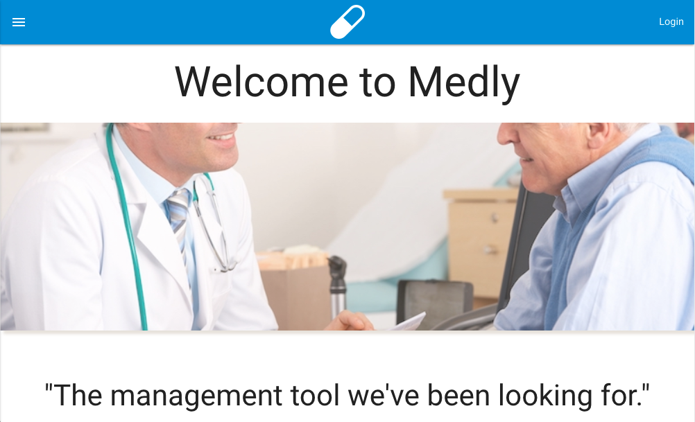
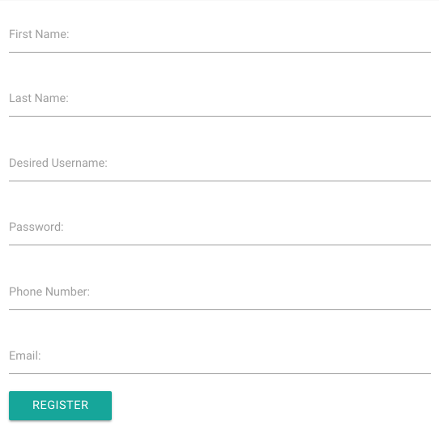
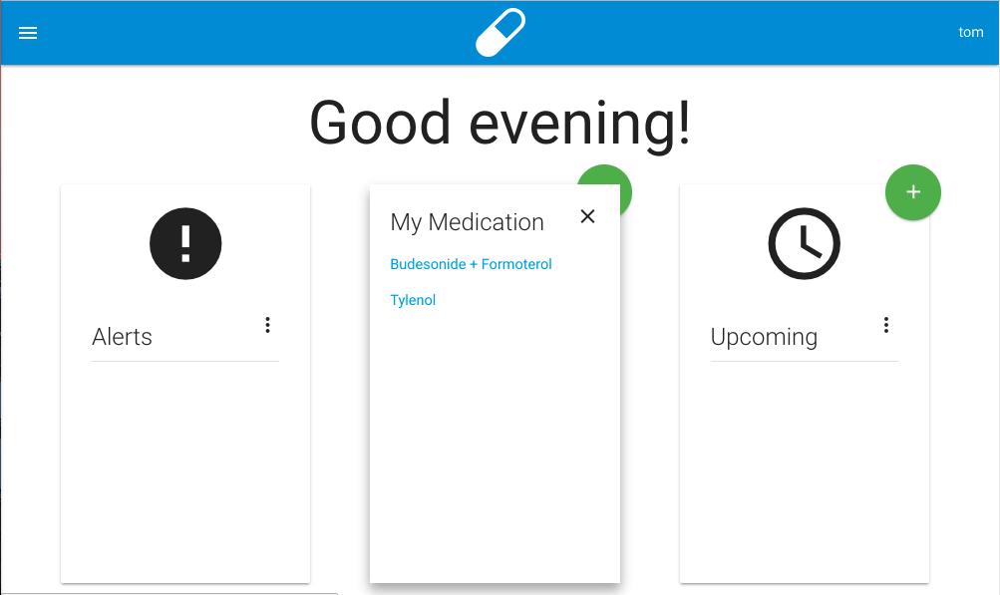

#Medly
### Medication Management
Medly medication management software was designed and created as a
capstone project for [Codeup][1]. The product frontend was built
using HTML5, CSS3/Materialize, and paralax. The backend of the project
was built on java, utilizing Spring, Hibernate and mysql. 

The application requires users to register. Once registration is complete,
a text message, using [Twillio][2], will be sent to the phone number you used
to register with. 

After you have registered, you will be brought to the login page where 
you would enter your credentials. After logging in, you will be directed
to the main dashboard where you could enter your medication/prescriptions, view alerts,
and create upcoming evnts as reminders. 

[1]: http://www.codeup.com/    "Codeup" 
[2]: http://www.twillio.com/    "Twillio" 
[3]: http://www.codeup.com/    "Codeup" 